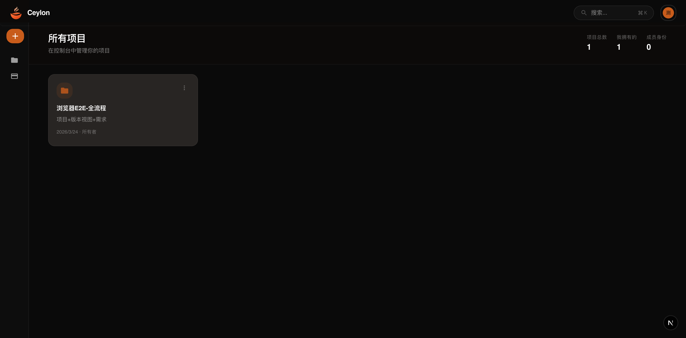

#  锡兰 CEYLON

锡兰（CEYLON）是一款面向企业团队的需求管理软件，帮助你把“反馈、决策、执行、复盘”串成可追踪的闭环。

## 产品定位

- 面向产品、研发、测试与运营协同的统一需求工作台
- 通过版本视图管理迭代范围，减少沟通损耗与需求漂移
- 将需求记录、状态推进、负责人协作整合到一个系统中

## 核心价值

- **可追踪**：每条需求从提出到完成有清晰状态与负责人
- **可协作**：项目成员按角色协作，分工与权限边界明确
- **可落地**：围绕版本视图进行迭代计划与发布管理
- **可扩展**：支持与自动化流程及命令行工作流衔接

## 功能一览

- 项目空间管理（创建、归档、成员协作）
- 多版本视图（按迭代组织需求）
- 结构化需求管理（编号、类型、优先级、状态、负责人）
- 团队权限体系（只读 / 可写 / 管理）
- 多语言与主题体验（适配不同团队使用习惯）

## 产品界面

### 首页

### 控制台

### 需求视图

## 适用场景

- 企业内部产品需求池管理
- 多团队并行开发下的版本协同
- 需求评审、排期与交付过程沉淀
- 面向客户反馈驱动的持续迭代

## 文档导航

- 产品与使用说明：`docs/start.md`
- 技术部署与开发细节：`docs/TECHNICAL_GUIDE.md`
- 接口与扩展能力：`docs/AUTH_ARCHITECTURE.md` 及 `docs/*`

## 商务与合作

如需商业合作、私有化部署或企业支持，请联系团队。
